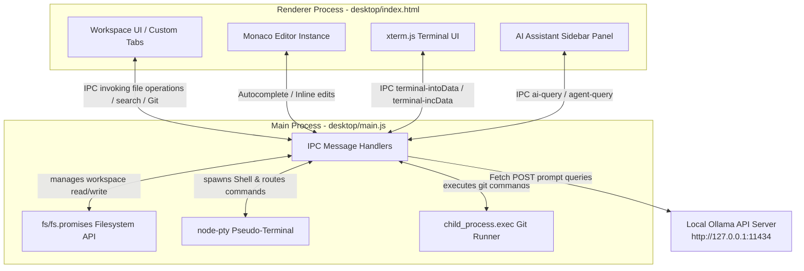

# 🌪️ Vortex IDE

An Electron-based, AI-powered autonomous local IDE and developer workspace. Vortex integrates Microsoft's Monaco Editor, native shell terminal emulation, Git management, global file searching, and a powerful local AI copilot and tool-using coding agent powered by Ollama.

---

## 📖 Project Overview

**Vortex** is a local-first, lightweight, and AI-augmented developer environment designed to bring intelligence and speed directly to your local workspace. Instead of relying on heavy cloud subscriptions or sending your source code to external servers, Vortex leverages **Ollama** running locally on your computer with light-weight coder models (e.g., `deepseek-coder:1.3b`) to perform context-aware code analysis, inline refactoring, ghost-text autocomplete, and recursive agentic task execution.

With its sleek dark theme and fully toggleable multi-pane layout, Vortex provides a complete IDE dashboard without memory overhead or setup complexity.

---

## ✨ Features

### 💻 Rich Code Editing
*   **Monaco Editor Integration**: Powered by Microsoft Monaco Editor (the core editor engine behind VS Code) for syntax highlighting, multi-cursor editing, map overview, code folding, and automatic layout adjustments.
*   **Tabbed Document Interface**: Edit multiple files simultaneously with an intuitive, dynamic tab navigation bar supporting dirty state indicators and tab-closing triggers.

### 🤖 Local AI Copilot & Autonomous Agent
*   **AI Copilot (Ask Mode)**: Ask coding questions, explain code snippets, or draft templates inside a dedicated sidebar chatbot panel. It automatically inherits selected editor lines or open file contexts.
*   **Autonomous Coding Agent (Agent Mode)**: Translate high-level prompts into recursive tool-based executions. The agent operates autonomously by generating action arrays, allowing it to:
    *   `read_file(path)`
    *   `write_file(path, content)`
    *   `create_file(path, content)`
    *   `run_terminal(command)` inside your current directory.
*   **AI Inline Edit (`Cmd+K` / `Ctrl+K`)**: Select a block of code, press the hotkey, type your refactoring instructions, and watch Vortex swap the code inline with AI suggestions.
*   **AI Ghost Text Autocomplete**: Real-time, debounced inline completions suggesting next logical lines of code as you type.

### 🐚 Deep System Integrations
*   **Integrated Terminal Panel**: Real-time terminal powered by `node-pty` on the backend spawning native shells (`zsh` on macOS/Linux, `cmd.exe`/`PowerShell` on Windows) and `xterm.js` rendering the terminal interface on the frontend.
*   **Interactive File Explorer**: Navigate workspace files and directories recursively through a custom-built file tree view with file-type syntax icons.
*   **Regex Global Search**: Instantly find text matches across all workspace files with exact line numbers and preview snippets, filtering out `.git` and `node_modules` automatically.
*   **Interactive Source Control (Git)**:
    *   Porcelain-tagged status monitoring displaying Modified (`M`), Added (`A`), Deleted (`D`), and Untracked (`??`) changes.
    *   Fast-commit bar enabling staging and committing all modifications with a single key press (`Cmd+Enter`/`Ctrl+Enter`).

### ⚙️ Command Palette & Layout Control
*   **Layout Toggles**: Instantly show or hide the Sidebar, Terminal panel, and AI Assistant panels via header shortcut buttons to maximize your editing focus.
*   **Command Palette (`Cmd+Shift+P` / `F1`)**: Search and execute commands such as reloading, triggering AI refactoring, opening folders, or explaining code blocks.
*   **Quick File Search (`Cmd+P`)**: Search and jump to files in the directory by name.

---

## 🛠️ Tech Stack

| Layer | Technology | Purpose |
| :--- | :--- | :--- |
| **Framework** | **Electron** (`^40.7.0`), **Node.js** | Multi-platform desktop application container |
| **Editor Core** | **Monaco Editor** (`^0.55.1`) | High-performance text editor engine |
| **Terminal backend** | **node-pty** (`^1.1.0`) | Spawns pseudo-terminal processes for native shells |
| **Terminal Frontend** | **xterm.js** (`^6.0.0`) | Render and capture input/output in the web UI |
| **Styling** | **Vanilla CSS** | Slick, clean dark-mode developer UI |
| **AI Model API** | **Ollama Local Server** | Serves the `deepseek-coder:1.3b` model locally |
| **Build Tools** | **@electron/rebuild** (`^4.0.3`) | Compiles native bindings (`node-pty`) for Electron |

---

## 📐 Architecture

Vortex follows the standard Electron process model, separating native operating system interactions from UI rendering:



### IPC Channel Catalog

To communicate securely, the Renderer invokes asynchronous Main process APIs via Electron IPC channels:
*   `read-file` / `save-file`: Direct filesystem operations.
*   `open-folder`: Prompts the OS directory picker, recurses the tree, and populates the Explorer.
*   `search-files`: Performs multi-file scanning based on user query string.
*   `git-status` / `git-commit`: Interrogates local repository and commits staged changes.
*   `terminal-intoData` / `terminal-incData`: Bridges keyboard entries and system shell outputs.
*   `ai-query` / `ai-autocomplete` / `ai-edit` / `agent-query`: Communication with the local Ollama LLM.

---

## 🚀 Installation & Setup

Follow these steps to run Vortex IDE locally on your machine.

### Prerequisites
1.  **Node.js**: Ensure you have Node.js (v18+) and `npm` installed.
2.  **Git**: Verify Git is installed and available in your environment variables.
3.  **Ollama**:
    *   Download and install [Ollama](https://ollama.com/).
    *   Start the Ollama daemon on your system.
    *   Pull the default model in your terminal:
        ```bash
        ollama run deepseek-coder:1.3b
        ```

### Installation Steps

1.  **Clone the Repository**:
    ```bash
    git clone https://github.com/Halenjosh/Vortex.git
    cd Vortex
    ```

2.  **Install Root Dependencies & Compile Native Modules**:
    Because Vortex uses native C++ code (via `node-pty`), you must build these bindings for Electron's runtime:
    ```bash
    npm install
    npx electron-rebuild
    ```

3.  **Install Desktop Renderer Dependencies**:
    Navigate to the `desktop` directory and install Monaco and xterm packages:
    ```bash
    cd desktop
    npm install
    ```

4.  **Run Vortex**:
    Start the Electron desktop application:
    ```bash
    npm start
    ```

---

## ⌨️ Keyboard Shortcuts Reference

| Shortcut | Action | Scope |
| :--- | :--- | :--- |
| `Cmd/Ctrl + O` | Open Folder Select Dialog | Global |
| `Cmd/Ctrl + P` | Quick Open File Search Palette | Global |
| `Cmd/Ctrl + Shift + P` / `F1` | Open Action Command Palette | Global |
| `Cmd/Ctrl + Shift + F` | Switch sidebar focus to Global Search | Global |
| `Cmd/Ctrl + K` | Trigger Inline AI Edit on Selection | Monaco Editor |
| `Cmd/Ctrl + S` | Save current file content | Monaco Editor |
| `Cmd/Ctrl + Enter` | Trigger AI message submission | AI Text Panel |
| `Cmd/Ctrl + Enter` | Stage and Commit changes | Git Message Field |

---

## 📸 Screenshots

Here is a conceptual view of the Vortex IDE dark mode theme layout containing the recursive tree explorer, terminal view, and AI sidebar.

```
+-------------------------------------------------------------------------------+
| 🌪️ Vortex IDE                                         [Sidebar] [Panel] [AI]   |
+------------------------------------+--------------------------+---------------+
| Explorer     | index.html          |                          | AI Copilot    |
| - index.html |                     |                          | Mode: ASK     |
| - main.js    | 1 <!DOCTYPE html>   |                          |               |
| - package.json                     |                          | User: How does|
|              | 2 <html>            |                          | xterm work?   |
| Search       |                     |                          |               |
|              | 3   <head>          |                          | Bot: It maps  |
| Source Cont. |                     |                          | native pty to |
|              |                     |                          | frontend terminal|
|              |                     |                          |               |
|              |                     |                          |               |
|              |                     |                          | Ask AI...     |
+--------------+---------------------+--------------------------+---------------+
| Terminal                                                                      |
| halen-macbook:Vortex halen$ npm start                                         |
+-------------------------------------------------------------------------------+
```

*(Place your real screenshots inside a `/screenshots` folder and update references here)*

---

## 🔮 Future Scope

*   **Multi-Workspace Management**: Open multiple project roots concurrently, toggling between different workspaces.
*   **AI Model Selector**: Direct config panel in the UI to swap between different local Ollama models (e.g., `llama3`, `codegemma`, `mistral`) or hook up to external API gateways.
*   **Full Agent Tool Auditing**: Enhanced sandbox permission controls before the AI agent performs terminal commands or file overrides.
*   **Diagnostics & Linter Integration**: Connect Monaco editor directly with local typescript/eslint processes to display syntax errors/warnings in real-time.

---

## 📄 License

This project is licensed under the [MIT License](file:///Users/halen/Desktop/Projects/Git%20Projects/Vortex/LICENSE).
